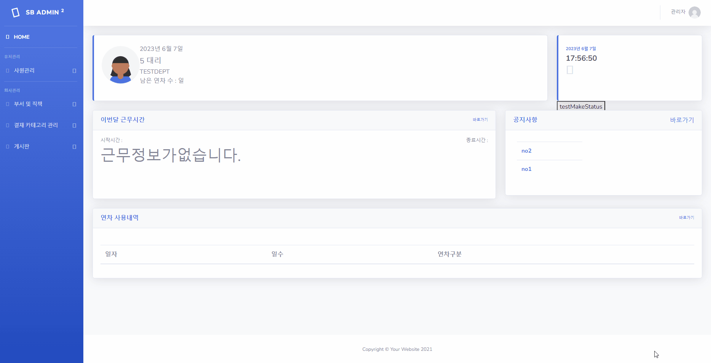
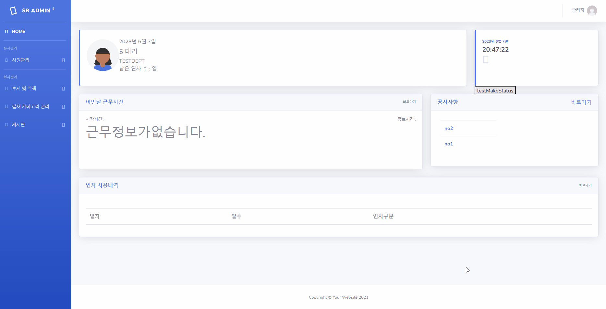
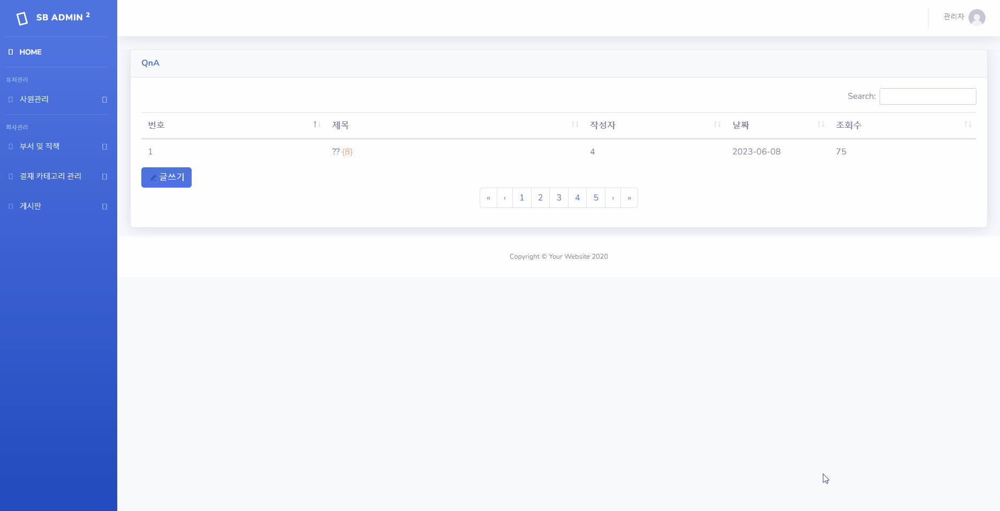
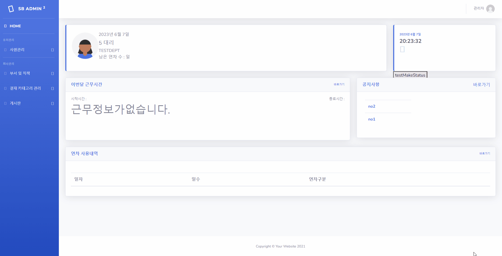
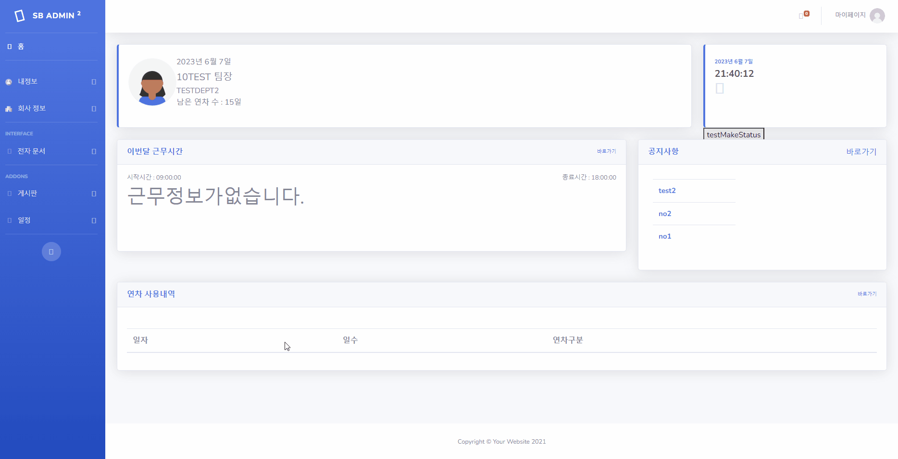
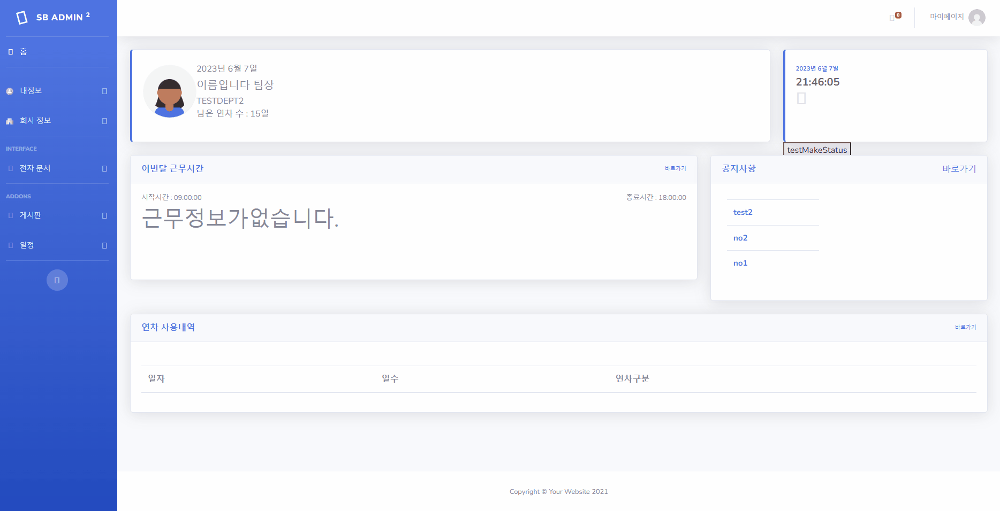
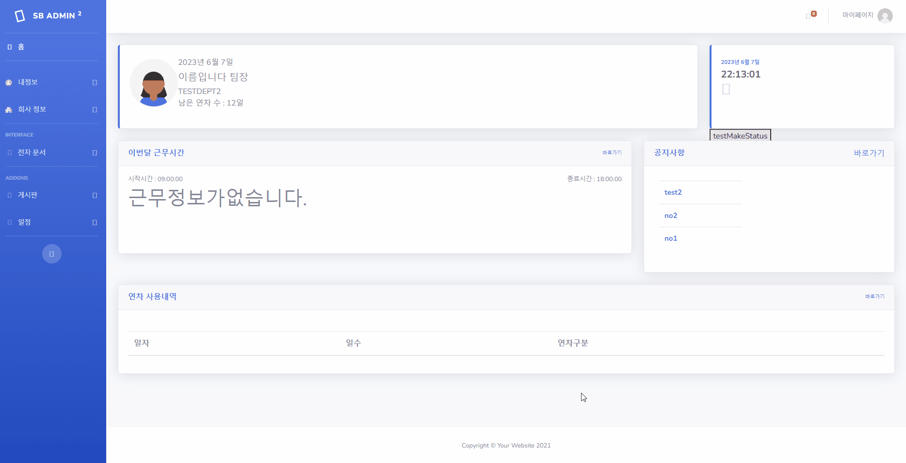
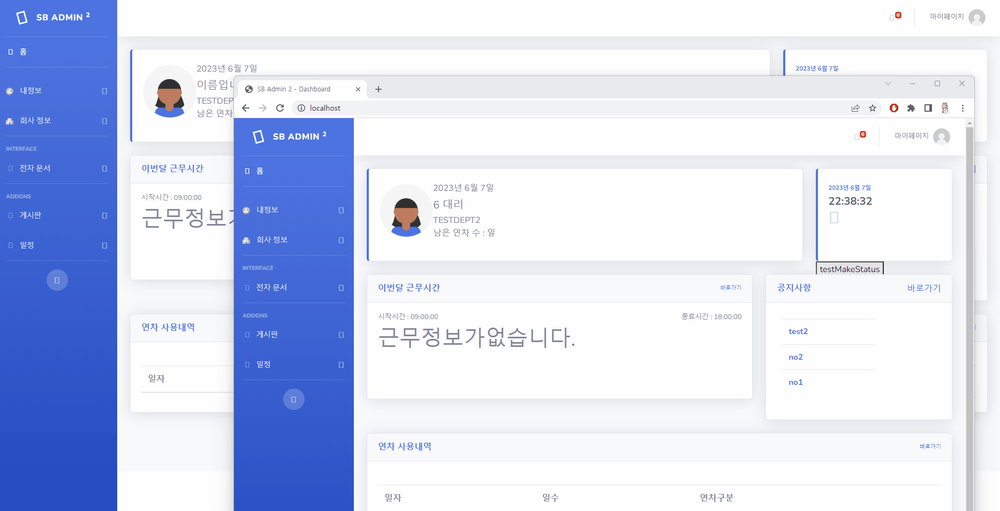

# 그룹웨어 프로젝트 (기말)
## 목차

- [프로젝트 개요](#프로젝트-개요)
- [팀 역할 분배](#팀-역할-분배)
- [사용 기술 및 도구](#사용-기술-및-도구)
- [기능구현](#기능구현)
  - 회원 관리
    - 직책 관리
    - 부서 관리
    - 회원 개인정보 관리
    - 근태 관리
  - 문서 결재
    - 문서 결재 카테고리 관리
      - 결재자 관리
      - 결재 양식 관리
      - 결재 카테고리명 관리
    - 문서 결재 관리
      - 문서 결재 신청 관리
      - 문서 결재 관리
      - 문서 PDF 다운로드
  - 게시판
    - 공지사항 게시판
    - QNA 게시판
  - 캘린더
    - 일정 관리
  - 실시간 알림
- [배포](#배포)
- [ISSUE](#ISSUE)

## 프로젝트 개요

   
<!--    -->
   

> **프로젝트:** 그룹웨어
>
> **기획 및 제작:** 이승엽, 정상구, 김태현, 이규원, 전승민
>
> **분류:** 팀 프로젝트 
>
> **제작 기간:** 2023.05.17 ~ 06.22
>
> **배포일:** 미정
>
> **사용 언어:** JAVA
> 
> **프레임 워크:** Spring Framework

## 팀 역할 분배
> **팀장:** 이승엽
> 
> 결재 카테고리 관리 : 카테고리 관리, 결재자 관리, 결재 양식 관리
> 
> 실시간 알림 : QNA 게시판 댓글, 결재 알림 전송
>
> 사이드 바 : 사용자 페이지 사이드 바 ( 결재 관련 ) , 관리자 페이지 사이드 바 ( 전체 )

> **팀원:** 정상구
>
> 게시판 관리 : 공지사항 게시판, QNA 게시판, QNA 댓글
>
> Top Bar : 사용자 페이지 Top Bar
>
> 메인 페이지 디자인 수정

> **팀원:** 김태현
>
> 회원 관리 : 회원 가입, 회원 직책 관리( 관리자 ), 회원 부서 관리( 관리자 ), 근태 관리

> **팀원:** 이규원
>
> 캘린더 : 일정 관리

> **팀원:** 전승민
>
> 문서 결재 관리 : 문서 결재 신청 관리, 문서 결재 관리, 문서 PDF 다운로드
>
> 실시간 알림 : QNA 게시판 댓글, 결재 알림 전송

## 사용 기술 및 도구

|**Category**|**Detail**|
|:--:|:--:|
|**FrontEnd**|`HTML5`, `JavaScript`, `JQuery`, `BootStrap`, `CSS`|
|**BackEnd**|`Java(11)`, `Servlet`, `Spring Boot`, `Mybatis`|
|**OS**|`Windows 10`, `Windows 11`|
|**Libray & API**|`Spring Security`, `Validation`, `FileUpload`, `Server-Sent Event(SSE)`, `Lombok`, `gson`|
|**IDE**|`STS4`, `VisualStudio Code`, `DBeaver`|
|**Server**|`Tomcat(v8.5)`|
|**Document**|`Google Drive`, `ERDCloud`, `Miro`, `Notion`|
|**CI**|`Github`|
|**DB**|`AWS RDS`, `Docker`, `MariaDB`|

## 기능구현
### 1. 관리자 페이지
  ####   1_1. 관리자 페이지는 admin 계정만 접근 가능
  

  ####   1-2. 부서와 직책 관리 기능
  
      
  ####   1-3. 결재 카테고리 관리 기능
  - 결재 카테고리 생성
  
        
  - 결재 카테고리 수정/삭제 (결재자, 양식)
    - 하위 카테고리가 1개 존재하는 경우에 하위 카테고리를 삭제하면 상위 카테고리에 결재 양식과 결재자를 등록하게 됨 (미 등록 시 하위 카테고리 삭제 불가)
    - 상위 카테고리가 삭제 될 경우 하위카테고리도 함께 삭제 됨
    - 각 카테고리의 결재자는 최소 한명 이상이 필요함
  
        
  ####   1-4. 게시판 관리 기능
  - 모든 게시판 글 및 댓글은 관리자가 삭제 가능
 
  - 공지사항 게시판 관리
    - 공지사항 작성 및 수정 가능
    - 중요 표시 체크 여부를 통해 게시판 리스트 페이지에서 강조 및 글 위치를 최 상단에 고정할 수 있음
  
  
  - QNA 게시판 관리
  
  
  ####   1-5. 회원(사원) 관리 기능
  - 새로운 사원을 생성
  
  
  - 전체 사원의 목록을 확인하고 수정
  

### 2. 사용자 페이지
  ####   1_1. 개인정보 수정 기능
  - 마이페이지 개인정보(아이디, 이름 등) 수정
  
  - 보안관리 페이지 비밀번호 수정
  

  ####   1-2. 근태 및 연차 관리 기능
  - 근태 및 연차 확인 ( 수정 필요 )
  
  
  ####   1_3. 전자문서 결재 신청 기능
  - 전자문서 결재 신청
  

  ####   1_4. 전자문서 결재 기능
  - 전자문서 결재 (승인, 거부)
  (결재 문서 리스트가 나오지않는 오류 있음)

  ####   1_5. 전자문서 결재 여부 확인 기능
  - 신청한 전자문서 결재 여부 확인
  (결재 문서 리스트가 나오지않는 오류 있음)

  ####   1_6. 게시판 기능
  - 관리자 페이지의 게시판 관리 기능과 동일
 
  ####   1_7. 일정 기능
  - 일정 관리 및 수정 기능
  - 일정 확인 기능
  (추가 캡쳐 따로 해야함)
  
  ####   1_8. 실시간 알림 기능
  - 나에게 도착한 실시간 문서 결재 요청이 있을 경우 &  QNA 작성 글 또는 댓글에 댓글이 달릴 경우
    - 다른 계정으로 댓글 작성시 알림이 실시간으로 전송 됨.
  
  
    - 결재 신청시 알림이 실시간으로 전송 됨.(결재 오류 해결 후 캡쳐 필요)

## 배포
**미정**

## ISSUE
  - 결재 양식 파일 등록시 파일의 종류를 거르지 않으나, HTML/HTM 파일로 업로드를 해야 정상적으로 양식을 불러올 수 있음.
  - 관리자가 사원 개인정보 수정하는 파트에서의 문제가 있음.
  - 관리자가 사원 회원가입을 먼저 진행하는데 DB로 정상 저장되나, 오류페이지로 넘어감.
  - 근태 및 연차 관리 페이지 오류로 인해서 근태 생성이 안됨.
  - 사용자 사이드 바 전자문서 탭 수정 필요.
  - 휴가 신청 관련 문서는 필수적으로 입력되야하는 값이 존재함.
  - 결재할 문서 리스트가 나오지않는 오류
